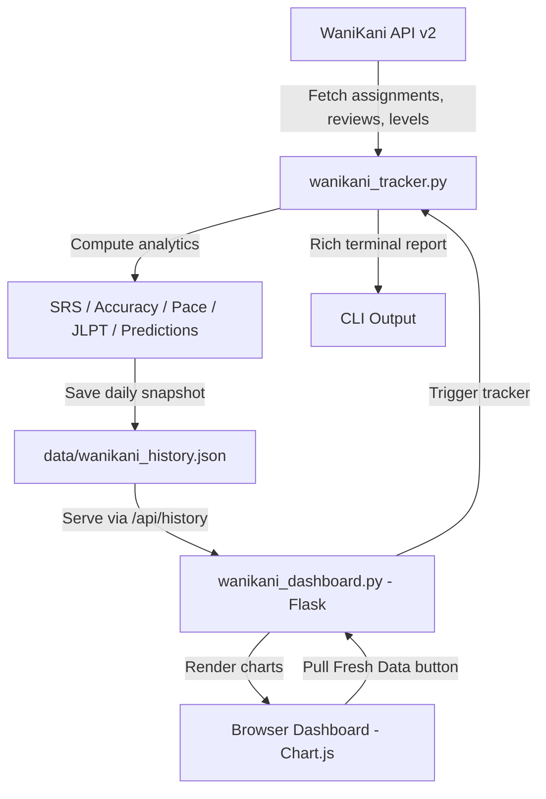

# WaniKani Tracker & Dashboard

[]()
[]()
[]()
[]()
[]()

A progress tracker and web dashboard for [WaniKani](https://www.wanikani.com/) that predicts your N2/N1 JLPT kanji completion dates, analyzes your review accuracy and pace, and visualizes your learning trajectory over time.

## Architecture



<!-- SCREENSHOT: Add screenshot of the dashboard progress tab here -->


## What It Does

Fetches your live WaniKani data, computes 7 analytics dimensions (SRS distribution, accuracy, pace, JLPT coverage, level-up estimates, JLPT predictions, session/streak tracking), and saves daily snapshots. The Flask dashboard renders interactive Chart.js charts showing trends over time plus community cohort comparisons.

**Who this is for:** WaniKani learners who want deeper progress analytics and N2/N1 forecasts than the default UI provides.

## Tech Stack

- **Python 3.11+** — core analytics engine
- **Flask** — lightweight web server for the dashboard
- **Chart.js 4** — interactive browser charts
- **Rich** — terminal report formatting
- **WaniKani API v2** — data source for assignments, reviews, and level progressions

## Installation

```bash
# 1. Clone and install
git clone https://github.com/benaiahbrown/wanikani-tracker.git
cd wanikani-tracker
pip install -r requirements.txt

# 2. Add your WaniKani API key
cp .env.example .env
# Edit .env and add your key
```

## Environment Setup

Copy `.env.example` to `.env` and fill in your values:

| Variable | Required | Description |
|----------|----------|-------------|
| `WANIKANI_API_KEY` | Yes | Your WaniKani personal access token. Generate one at [wanikani.com/settings/personal_access_tokens](https://www.wanikani.com/settings/personal_access_tokens) |
| `WANIKANI_START_DATE` | No | Override start date for "days studied" calculation (YYYY-MM-DD). Defaults to your WaniKani account creation date |

## Usage

```bash
# Run the tracker (fetches data + prints terminal report + saves snapshot)
python3 wanikani_tracker.py

# Start the dashboard
python3 wanikani_dashboard.py
# Open http://localhost:8082
```

Run the tracker regularly (daily is ideal) to build up snapshot history for the dashboard charts. You can also pull fresh data directly from the dashboard using the **Pull Fresh Data** button.

<!-- SCREENSHOT: Add screenshot of the terminal tracker report here -->


### CLI Options

```bash
python3 wanikani_tracker.py              # Terminal report + save snapshot
python3 wanikani_tracker.py --json       # Raw JSON output
python3 wanikani_tracker.py --refresh    # Force-refresh subjects cache

python3 wanikani_dashboard.py            # Dashboard on port 8082
python3 wanikani_dashboard.py --port 9000  # Custom port
```

## What It Tracks

| Metric | How It's Calculated |
|--------|-------------------|
| **SRS Distribution** | Counts kanji/vocab by WaniKani SRS stage (Apprentice 1-4, Guru 5-6, Master 7, Enlightened 8, Burned 9) |
| **Accuracy** | `correct / (correct + incorrect)` for meaning and reading reviews separately |
| **Pace** | `(passed_at - started_at)` per level from level progressions; reports avg, recent-5 avg, fastest, slowest, std dev |
| **JLPT Coverage** | Maps WK levels to JLPT (N5=1-10, N4=11-16, N3=17-35, N2=36-48, N1=49-60), counts Guru+ kanji per band |
| **Level-Up Estimate** | SRS interval math (4h+8h+23h+47h per stage) adjusted by `1/(meaning_acc * reading_acc)` accuracy multiplier |
| **N2/N1 Predictions** | Level-based (remaining levels x pace) and coverage-based (remaining kanji / kanji-per-day) |
| **Sessions & Streaks** | Activity timestamps clustered by 30-min gaps; consecutive-day streak counting |

## Dashboard Views

Designed to be run locally; no data is sent anywhere except WaniKani's API.

### Progress Tab
- Level progress over time (with N2/N1 target lines)
- Items learned (kanji + vocab Guru+ counts)
- Kanji SRS distribution (stacked bar)
- Accuracy trend (meaning/reading for kanji and vocab)
- JLPT coverage % per level
- N2/N1 prediction convergence chart
- Level-up estimate panel with upcoming review schedule

### Cohort Comparison Tab
- Pace vs community (speed runner through casual)
- Accuracy vs community median (with percentile ranges)
- Learning trajectory vs reference pace lines
- Sessions per day (30-day history)
- Study streak stats + gauge

## File Structure

```
wanikani_tracker.py          # Data fetcher + analytics engine + terminal report
wanikani_dashboard.py        # Flask web dashboard (single-file, embedded HTML/JS/CSS)
.env                         # Your API key (git-ignored)
.env.example                 # Template
requirements.txt             # Python dependencies
data/                        # Auto-created, git-ignored
  wanikani_history.json      # Daily snapshot history
  wanikani_subjects_cache.json  # Kanji subjects cache (7-day TTL)
```

## Roadmap

- Forecast accuracy improvement: weight recent reviews more heavily in predictions
- Per-item difficulty tracking: identify leeches (items with high fail rates)
- Email/notification alerts when reviews are piling up
- Export snapshot history to CSV for external analysis
- Mobile-responsive dashboard improvements

## License

MIT
